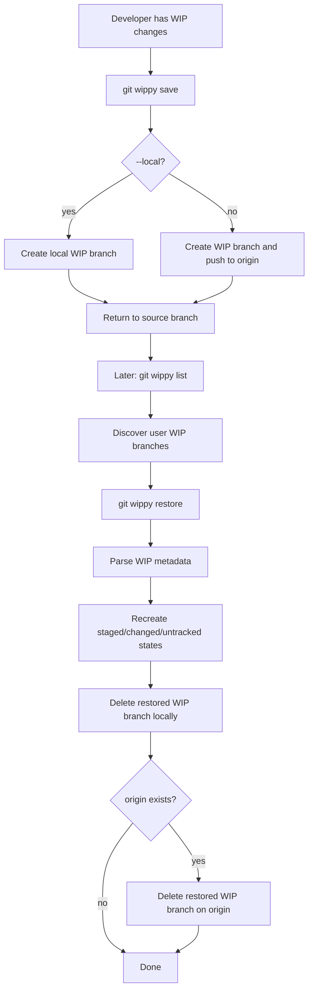
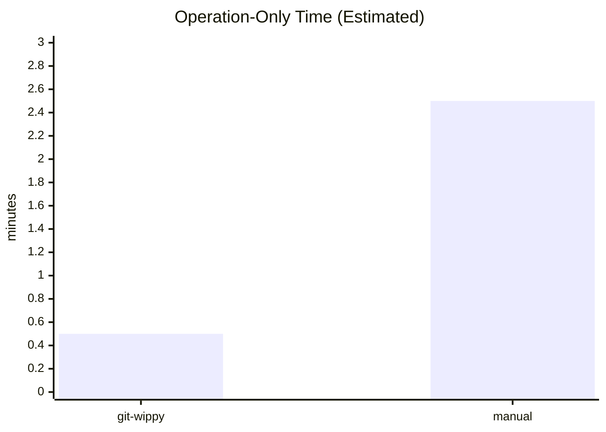
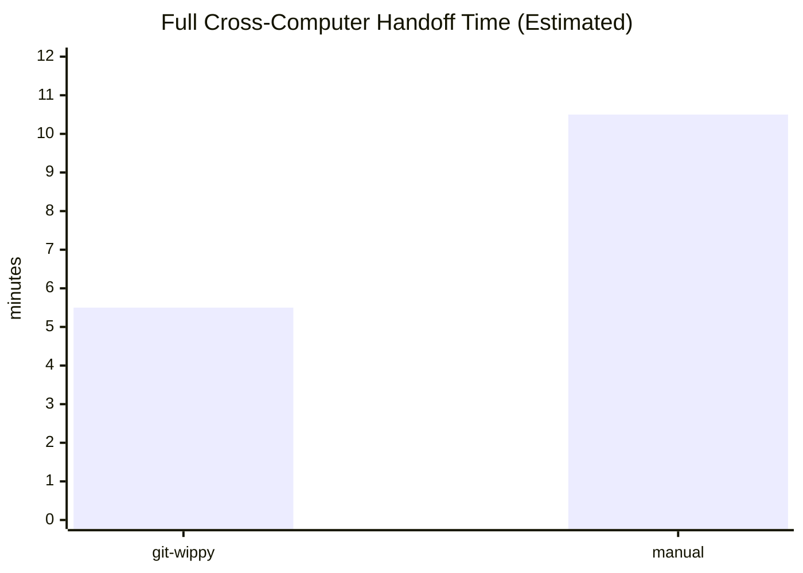

# git-wippy Product Specification

## 1. Document Control

- Status: Draft (authoritative for expected product behavior)
- Last updated: 2026-02-27
- Product: `git-wippy`
- Repo: `mekwall/git-wippy`

## 2. Product Definition

`git-wippy` is a Git-oriented CLI that preserves work-in-progress (WIP) changes in dedicated branches and restores those changes later, including staged/unstaged/untracked intent.

Primary goal:

1. Let users suspend in-flight local work safely.
2. Make that work recoverable on demand.
3. Keep workflow simple: save, list, restore, delete.

## 2.1 Workflow Overview

## 3. Scope

### 3.1 In Scope

1. Save current working tree state into a WIP branch.
2. List user-scoped WIP branches.
3. Restore WIP content back to source branch with optional autostash of current local work.
4. Delete WIP branches locally and optionally remotely.
5. Localized user-facing messages (Fluent locales).

### 3.2 Out of Scope

1. Replacing Git stash internals.
2. Full conflict auto-resolution strategy beyond current branch/stash orchestration.
3. Release packaging and distribution channels.
4. Multi-user access control or server-side state management.

## 4. Target Users and Usage Context

1. Developers working in Git repositories who need to pause/resume unfinished changes.
2. Users switching branches frequently and needing durable WIP snapshots.
3. Teams where WIP may optionally be pushed to remote for backup/collaboration.

## 4.1 Cross-Computer Workflow (Remote WIP)

One of the strongest `git-wippy` workflows is moving WIP between machines through remote-backed WIP branches.

Typical flow:

1. On Computer A, run `git wippy save` (without `--local`) to create a WIP branch and push it to `origin`.
2. On Computer B, fetch and run `git wippy list` to discover the same WIP branch.
3. On Computer B, run `git wippy restore <wip-branch>` to reconstruct the original file intent and continue working.

Behavioral notes:

1. If no remote exists, save remains local and reports that remote push was skipped.
2. Restore cleanup removes restored WIP refs locally and on `origin` when remote exists.
3. This makes WIP handoff across devices fast while keeping normal Git branch workflows.

## 4.2 Estimated Time Savings (Cross-Computer Handoff)

This section provides an illustrative, conservative timing model for comparing a remote-backed handoff using `git-wippy` vs manual Git steps.

Two views are intentionally separated:

1. Operation-only (tool-attributable work).
2. Full handoff (operation-only work plus shared cross-machine overhead).

Model assumptions (typical case):

1. `git-wippy` path uses 3 user commands (`save`, `list`, `restore`), while an equivalent manual flow takes about 15 user commands.
2. Average command runtime is modeled at 5 seconds (network + repo variability included).
3. Average human verification pause per command is modeled at 5 seconds (confirming expected output and intent).
4. Shared cross-machine re-orientation is modeled as 5 minutes for both approaches.
5. Manual flow adds 3 minutes of extra re-orientation/reconstruction overhead on Computer B (rebuilding context and sequencing operations manually).

Derived estimate (operation-only):

1. `git-wippy`: `3 * (5s + 5s) = 30s`
2. Manual: `15 * (5s + 5s) = 2m 30s`
3. Estimated tool-attributable time saved: `2m` (~80%).

Derived estimate (full handoff, with shared overhead):

1. `git-wippy`: `5m + 30s = 5m 30s`
2. Manual: `5m + 2m 30s + 3m = 10m 30s`
3. Estimated end-to-end time saved: `5m` (~48%).

Notes and caveats:

1. This is a planning/communication model, not a benchmark or SLA.
2. The operation-only view is the fairest measure of tool efficiency because it excludes shared overhead.
3. The full-handoff view is useful for end-to-end planning but includes time not caused by either tool.
4. Very large repositories or poor network conditions can increase both paths.
5. The relative gain usually grows with workflow complexity because manual steps and verification points scale faster.

## 5. System Context and Dependencies

1. Runtime: Rust CLI binary (`git-wippy`, used as `git wippy` subcommand).
2. External dependency: local `git` executable and repository context.
3. Optional remote interactions: `origin` push/delete behavior.
4. Localization: Fluent files in `locales/*.ftl`.

## 6. Domain Model

### 6.1 WIP Branch Naming

- Pattern: `wip/{username}/{datetime}`
- `username`: explicit CLI arg or `git config user.name`
- `datetime`: explicit CLI arg or generated formatted timestamp

### 6.2 WIP Metadata Encoding

WIP metadata is encoded in commit message text created during `save`.

Required metadata:

1. Source branch name.
2. Staged files section.
3. Changed (unstaged) files section.
4. Untracked files section.

### 6.3 File State Categories

1. Staged files.
2. Changed but unstaged files.
3. Untracked files.

Restore logic must reconstruct these states as closely as possible.

## 7. CLI Surface

Source of truth: `src/cli.rs`.

Commands:

1. `save` (`alias: s`)
   - Flags:
     - `--local` (do not push to remote)
     - `--username <USERNAME>`
     - `--datetime <DATETIME>`
     - `-m, --message <MESSAGE>`
2. `list` (`alias: l`)
   - Flags:
     - `-a, --all` (show WIP branches for all users)
3. `restore` (`alias: r`)
   - Args/flags:
     - `[BRANCH]` optional
     - `-y` force/skip confirmation semantics
     - `--autostash`
4. `delete` (`alias: d`)
   - Args/flags:
     - `[BRANCH]` optional
     - `--all`
     - `--force`
     - `--local`

Notes:

- Help/command descriptions are localized via i18n keys.

## 8. Functional Requirements

### FR-1 Save WIP (`save`)

The system shall:

1. Resolve username and datetime (explicit args override defaults).
2. Accept optional custom message prefix via `-m, --message`.
3. Capture current branch as source branch.
4. Build a commit message encoding source/staged/changed/untracked file lists.
5. If custom message is provided, prepend it while preserving metadata sections.
6. Create and switch to `wip/{username}/{datetime}`.
7. Stage all changes (`git add -A`).
8. Commit with generated message.
9. If `--local` is not set:
   - Detect remotes.
   - Push to `origin` when present.
   - Print skip message when no remote exists.
10. Checkout original branch.
11. Print completion messages (localized).

### FR-2 List WIP (`list`)

The system shall:

1. Resolve current username.
2. Query local and remote refs and extract WIP refs.
3. By default, filter to current user; with `--all`, include all users.
4. De-duplicate branch names where local and remote refs overlap.
5. Print no-branches message when empty.
6. Print found branches when non-empty.

### FR-3 Restore WIP (`restore`)

The system shall:

1. Resolve current username and available WIP branches.
2. Select branch by:
   - explicit branch arg if provided and valid,
   - interactive select if multiple and no explicit arg,
   - sole branch automatically if exactly one,
   - no-op with message if none.
3. Parse WIP commit message metadata to recover source branch and file-state groups.
4. If local changes exist and `--autostash` is absent, fail with actionable error.
5. If `--autostash` is used with local changes:
   - stash current local changes under deterministic name,
   - restore WIP payload,
   - attempt re-apply preserved local changes.
6. Ensure source branch exists (checkout existing or create then checkout).
7. Apply file contents from selected WIP branch into working tree.
8. Recreate staged/changed/untracked intent via stage/unstage operations.
9. Delete restored WIP branch locally.
10. Delete remote WIP branch from `origin` if available.
11. Print completion messages.

### FR-4 Delete WIP (`delete`)

The system shall:

1. Resolve current username and available WIP branches.
2. Determine deletion set via one of:
   - `--all`,
   - explicit `[BRANCH]`,
   - single-branch flow,
   - interactive multi-select for multiple branches.
3. Respect `--force` for confirmation bypass.
4. Respect `--local` to skip remote deletion.
5. If remote deletion is allowed and `origin` exists, optionally confirm and delete remote refs.
6. Always delete selected local WIP refs.
7. Continue processing even if remote deletion fails for a branch, with explicit error output.
8. Print summary completion message.

## 9. Internationalization Requirements

1. Supported locale resources: `en-US`, `en-GB`, `de-DE`, `fr-FR`.
2. Locale detection order:
   - `LANG`
   - `LC_ALL`
   - `LC_MESSAGES`
3. Unknown/unsupported locale shall fall back to `en-US` behavior.
4. User-visible strings shall come from localization keys, not hardcoded English (except unavoidable prompts currently in code).

## 10. Error Handling Requirements

1. Git command failures shall return contextual errors.
2. Missing branch selections shall not panic; emit user-facing messages.
3. Restore without `--autostash` when local changes exist shall fail safely.
4. Remote-delete failures during delete shall be reported without masking local-delete success.

## 11. Non-Functional Requirements

1. Reliability: operations must avoid destructive behavior on unrelated branches.
2. Observability: clear localized CLI output at key steps.
3. Testability: command logic must remain mockable via `Git` trait.
4. Portability: must run in environments where Git is available.
5. Performance: optimized for normal repository-scale operations; no large-history analytics required.

## 12. Security and Safety Constraints

1. Never embed secrets in branch names, commit messages, or logs.
2. Do not run destructive history rewrites as part of normal workflow.
3. Preserve user working copy safety; fail early when ambiguity risks data loss.

## 13. Acceptance Criteria (Product-Level)

The product is conformant when all are true:

1. `save` creates a WIP branch and commits encoded metadata.
2. `list` reliably reports user WIP branches.
3. `restore` reconstructs content and file-state intent from WIP metadata.
4. `delete` supports explicit, all, and interactive selection modes.
5. Localization is functional across supported locales.
6. Integration tests in `tests/cli.rs` pass for core flows.

## 14. Verification Matrix

Required engineering checks:

1. `cargo fmt --all -- --check`
2. `cargo clippy --workspace --all-targets --all-features --locked -- -D warnings -W clippy::pedantic -W clippy::nursery`
3. `cargo test --workspace --all-features --locked`
4. `cargo doc --workspace --all-features --no-deps`
5. `mdbook build book`
6. `cargo build --workspace --release --locked`
7. RustSec audit check in CI (`rustsec/audit-check`)

## 15. Known Gaps and Follow-Up Items

1. Strict clippy policy is enabled in CI and currently surfaces legacy lint debt to be resolved incrementally.
